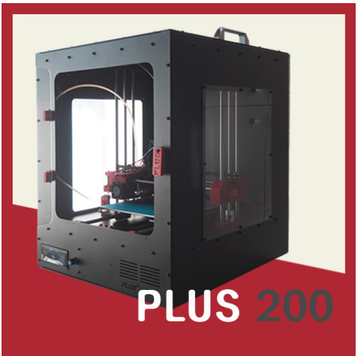
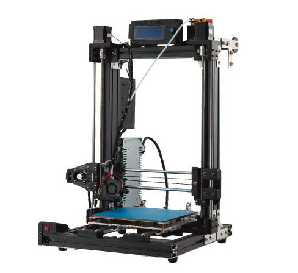

# 3D 프린터 (메이드 인 코리아, 2020년 1월 기준)

|   |  |  | | | | | | |
| ------------- | ------------- | ------------- | ------------- | ------------- | ------------- | ------------- | ------------- | ------------- |
| 프린터 이름  | 플러스 200  | 오버클론 223 블랙| | | | | | |
| 판  매  처 | [플러스 공방](https://smartstore.naver.com/diyplus) | [컴바인 3D](https://smartstore.naver.com/combine3d) | | | | | | |
| 가      격 | 1,430,000 원  | 528,000 원 | | | | | | |
| 간 단 설 명 |   | | | | | | | |
| 챔  버  형 | O | X | | | | | | |
| 조      립 | X | X | | | | | | |
| 완  제  품 | O | O | | | | | | |
| 제품크기(WxDxH) | 410x450x510 | 470x620x470| | | | | | |
| 출력크기(WxDxH) | 220x220x240  | 200x200x300| | | | | | |
| 무    게 | 20 kg  | ? | | | | | | |
| 출 력 속 도 | ? | ~ 200mm/s | | | | | | |
| S M P S | 12V 350W | 12V 250W| | | | | | |
| 마 더 보 드 | RAMPS 1.4? | RAMPS 1.4? | | | | | | |
| 드 라 이 버 | TMC-2208 | A4988 | | | | | | |
| 히 팅 베 드 | 알루미늄 히팅베드(?) | PCB MK2B | | | | | | |
| 베      드 | ? | 아노다이징 베드 | | | | | | |
| 오토레벨링 | ? | Inductive Sensor? | | | | | | |
| 필 라 멘 트 | PLA, ABS, TPU | PLA, ABS | | | | | | |
| 노 즐 개 수 | Single | Single | | | | | | |
| 익스트루더 | MK8 | Single | | | | | | |
| S D 카 드 | O | ? | | | | | | |
| USB 연 결 | O | ? | | | | | | |
| 자체 슬라이서 | X | X | | | | | | |
| 펌  웨  어 | ? | ? | | | | | | |
| 오 픈 소 스 | ? | ? | | | | | | |
| A/S 비 용 | ? | ? | | | | | | |
