# 20~30cm 출력 가능 3D 프린터 (2020년 1월 기준)
# #1
|   |  |  | 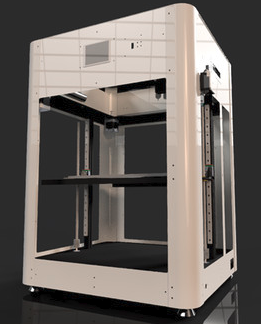| 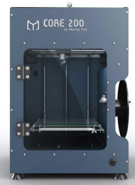| 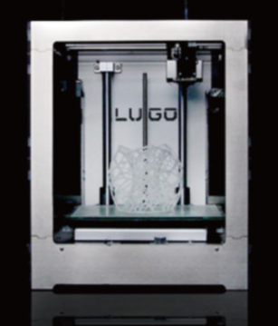 | 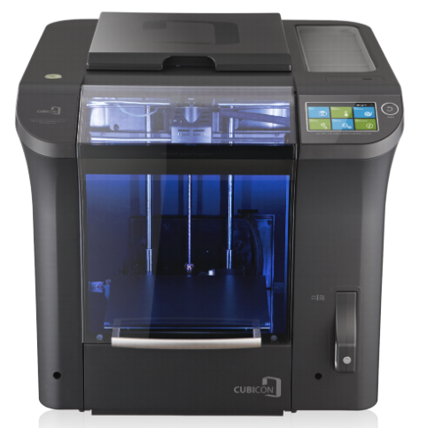 |
| ------------- | ------------- | ------------- | ------------- | ------------- | ------------- | ------------- |
| 프린터 이름  | 플러스 200  | 오버클론 223 블랙| MA3D | 코어200 | LUGO_M | CUBICON Single Plus |
| 판매처 | [플러스 공방](https://smartstore.naver.com/diyplus) | [컴바인 3D](https://smartstore.naver.com/combine3d) | [메이드올](https://smartstore.naver.com/madeall) | [코어시리즈](https://smartstore.naver.com/coreserise)| [포머스팜](https://formersfarm.com/)| [큐비콘](http://www.3dcubicon.com/)|
| 가격 | 1,430,000 원  | 528,000 원 | 1,674,000 원 | 610,000 원 | 1,991,000 원 | 3,520,000 원 |
| 간단 설명 |
| 커뮤니티 | [플러스공방](https://cafe.naver.com/joonggonara) | [컴바인](https://cafe.naver.com/overclone) | [메이드올](https://cafe.naver.com/madeall) | [메이킹툴](https://cafe.naver.com/makingtool) | [포머스팜](https://cafe.naver.com/shapewayskr) | [큐비콘](https://cafe.naver.com/3dcubicon)
| 챔버형 | O | X | 곡면철판+투명PC | 풀메탈 | O | O |
| 챔버 필터 |  | X |  |  |  | O |
| 조립 판매| X | X |  | 반조립 |  | X |
| 완제품 판매 | O | O |  |  |  | O |
| 제품크기(WxDxH) | 410x450x510 | 470x620x470| 380x400x550 | 350x362x500 | 340x340x400 | 554x579x524 |
| 출력크기(WxDxH) | 220x220x240  | 200x200x300| 310x310x350 | 200x200x200 | 215x215x200 | 240x190x200 |
| 무게 | 20 kg  |  | 25 kg |  | 14.5 kg | 32 kg |
| 출력 속도 |  | < 200 mm/s |  |  | < 300 mm/s | < 500 mm/s |
| SMPS | 12V 350W | 12V 250W| 24V Dual |  |  | 24V 25A |
| 마더보드 | RAMPS 1.4 | RAMPS 1.4 | MKS Gen v1.4 |
| 드라이버 | TMC-2208 | A4988 | XY(TMC2208) ZE(A4988)
| 히팅 베드 | 알루미늄 히팅베드() | MK2B | MK2A | MK2B |
| 베드 타입 |  | 아노다이징 베드 | 탄소코팅 유리
| 구동 방식 |  | MENDEL |  | CORE XY |
| 축 방식 |  |  | XTZ(MGN12H) | XY(연마봉)
| Z축 이동 |  |  | 리드 스크류 | TM 스크류 |
| 오토 레벨링 |  | Inductive Sensor | BL Touch |
| 필라멘트 센서 |  |  |  |  |  | O |
| 필라멘트 | PLA, ABS, TPU | PLA, ABS |  | PLA, ABS, Flexible | PLA, ABS, PC | ABS, PLA, TPU |
| 디스플레이 |  |  | MKS TFT32 |
| 노즐 개수 | Single | Single | Single | Single | Single |
| 핫엔드 |  |  |  |  |  |  |
| 익스트루더 | MK8 보우덴 |  | Titan st | 자체개발 |
| SD 카드 | O |  |  | O |  |  |
| USB 연결 | O |  | O | O | O | O |
| WIFI |  |  |  |  |  | O |
| 자체 슬라이서 | X | X | X | X | X | O |
| 펌웨어 | Marlin 1.8 |  |  |  |
| Custom 펌웨어 | 허용 |  |  |  |
| 오픈소스 | O |  |  |  |
| A/S 비용 | 무상수리 6개월 |  |  |  |

# #2

| | 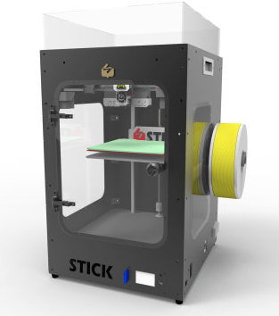 | 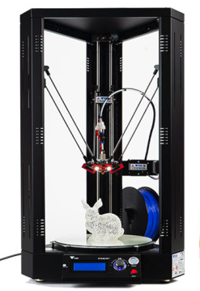 | 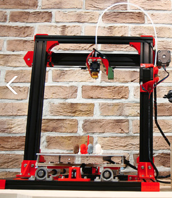 | 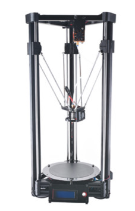 | 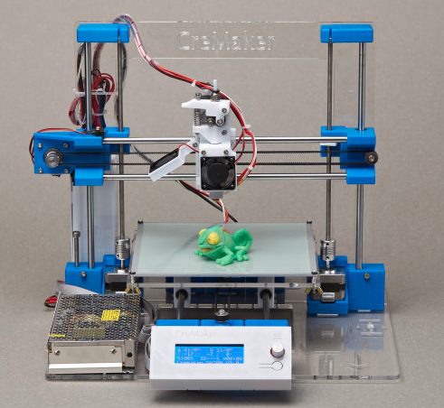 | 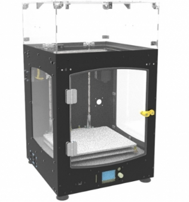 |
| ------------- | ------------- | ------------- | ------------- | ------------- | ------------- | ------------- |
| 프린터 이름  | STICK | S3D 250 | N3D N200 | 델타 250 | 크리메이커 오리지날| UT200 |
| 판매처 | [STICK](https://smartstore.naver.com/stick3d) | [스토리팜공방](https://smartstore.naver.com/farmspace) | [네오시스](https://smartstore.naver.com/neoizm) | [3Dfactory](https://smartstore.naver.com/samdnd) | [다락몰](https://smartstore.naver.com/cremaker) | [3D 아틀리에](http://www.3datelier.co.kr/) |
| 가격 | 1,450,000 원 |  2,700,000 원 | 550,000 원 | 550,000 원  770,000 원| 249,000 원| 650,000 원 |
| 간단 설명 |
| 커뮤니티 | [STICK 3D FROM](https://cafe.naver.com/3dkor) | | [네오시스](https://cafe.naver.com/neoizm) | | [크리메이커](https://cafe.naver.com/cremaker) | [3D 아틀리에](https://cafe.naver.com/3datelier) |
| 챔버형 | O | X | X | X | X | O |
| 챔버 필터 |  | X | X | X | X |  |
| 조립 판매 |  |  |  | O (550,000 원) |  |  |
| 완제품 판매 |  |  | | O (770,000 원) |  |  |  
| 제품크기(WxDxH) | 385x442x650 | 420x430x800 | 480x500x490 | 300x300x700 | 400x390x340 | 340x356x600 |
| 출력크기(WxDxH) | 210x200x270 | Ø 250 X 250 | 210x210x250 | Ø 180 x 250 |  | 200x200x200 |
| 무게 | 20 kg | 25 kg |  | 15 kg | 7 kg | 16 kg |
| 출력 속도 |  | 10~80 mm/s |  | <180 mm/s | 30 ~ 120 mm/s | 20 ~ 60 mm/s |
| SMPS |  | 12V 15A | 12V 350W | 120W | 100W (200W 옵션) | 24V  |
| 마더 보드 |  |  | MKS Base | 자체개발보드 |  | MKS Gen-L
| 드라이버 | TMC |  |  | DS 8825 |  | |
| 히팅 베드 |  | O |  | O | △ (옵션) |
| 베드 타입 |  | 에폭시 자석 |  | 유리베드 |  |
| 축 방식 | CORE XY | DELTA |  | DELTA | | |
| Z축 이동 |  | BELT | MENDEL | BELT |  | 리드스크류 |
| 오토 레벨링 | BL Touch | X | 금속타입 | 압력센서 |  | |
| 필라멘트 센서 |  |  |  |  |  |  |
| 필라멘트 | PLA, ABS, CARBON, WOOD  PC, PA, FLEXIBLE, PET-G | PLA, ABS | PLA, ABS, Wood, Flexible | ABS, PLA, TPU, HIPS  Flexible | PLA, ABS, TPU | PLA, ABS |
| 디스플레이 |  |  | 2004 LCD | MINI 12864 |  | MINI 12864 |
| 노즐 개수 |  |  |  | 1 |  | |
| 핫엔드 |  |  |  |  |  | E3D V6 |
| 익스트루더 |  |  보우덴 |  |  보우덴 |  |
| SD 카드 |  | O | O | O | O |
| USB 연결 |  |  | O | X |  |
| WIFI |  |  |  | X |  |  |
| 자체 슬라이서 |  |  |  | X |  |
| 펌웨어 |  |  |  | Marlin 2.0 |  | |
| Custom 펌웨어 |  |  |  |  |  | |
| 오픈소스 |  |  |  |  |  | |
| A/S 비용 |  |  |  |  |  | |

# #3

| | 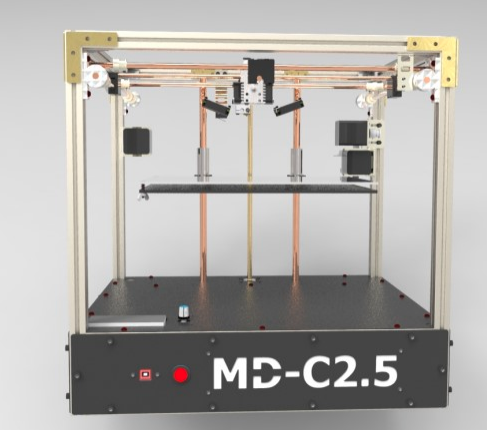 | 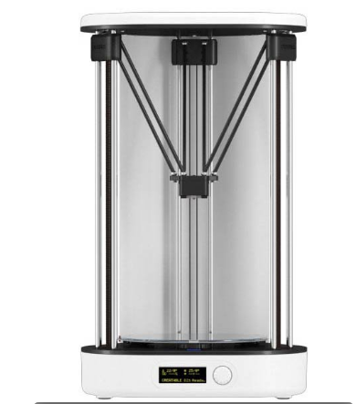 |  |  |  |  |
| ------------- | ------------- | ------------- | ------------- | ------------- | ------------- |------------- |
| 프린터 이름  |  MD-C2.5 | D3 |
| 판매처 | [내써팝](http://nasspop.com/) | [크리에이터블](https://creatablelabs.com/) |
| 가격 | 000,000  | 1,540,000 |
| 간단 설명 | 판매사이트 검색 볼가 |
| 커뮤니티 | | |
| 챔버형 | | X |
| 챔버 필터 | | X |
| 조립 판매 | | |
| 완제품 판매 | | |
| 제품크기(WxDxH) | |  |
| 출력크기(WxDxH) | | Ø 250 X 250 |
| 무게 | | 10 kg |
| 출력 속도 | | |
| SMPS | | 24V 9.16A |
| 마더 보드 | | |
| 드라이버 | | |
| 히팅 베드 | | O |
| 베드 타입 | | |
| 축 방식 | | DELTA |
| Z축 이동 | | BELT |
| 오토 레벨링 | | |
| 필라멘트 센서 | | |
| 필라멘트 | | |
| 디스플레이 | | |
| 노즐 개수 | | |
| 핫엔드 |  |  |  |  |  |  |
| 익스트루더 | | |
| SD 카드 | | O |
| USB 연결 | | O |
| WIFI | |  |
| 자체 슬라이서 | |
| 펌웨어 | | |
| Custom 펌웨어 | | |
| 오픈소스 | | |
| A/S 비용 | | |
